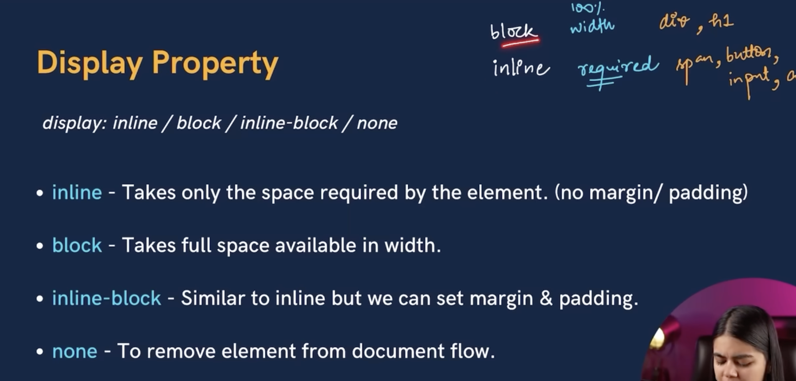

# 1st course
# why react, how it works
- react allows us to build dynamic interactive websites

# how react works:
- react uses virtual dom, which is a lightweight copy of the actual dom, when a state in a component changes, the virtual dom changes first, then react compares this with the actual dom then it updates only the parts that need to be updated.

## components:

## state

- to define a state in a functionall component you can use a hook.

- see redux for global state and state management

## hooks


## different types of websites


## vite

`npm create vite@latest`
## proj structure

- inside main.jsx, strict mode which is a wrapper component to check for potential problems, like deperacated, unsafe lifecycle methods, legacy context apis, etc.

## jsx crash course
- every react comoponent returns an html like syntax called jsx
- can only return a single element.

##  react router
- the App() function returns <ReactProvider router={router}/>
where router is:
`const router = createBrowserRouter(
    createRoutesFromElements(<Route index element={<HomePage />} />)
)`
here you can provide an explicit route or you can provide index which by default means '/' route

- for navbar and footers which appear on all pages yuo use `layouts`
so make a layouts folder, inside it
    - `MainLayout.jsx`, then use this as a parent route to the rest of our routes so they follow its layout

- useNavigate from react-router-dom ->
`const navigate = useNavigate()
...
return navigate('/');

# React props:
- In React, props are used to pass data from a parent component to a child component. 
- Props are read-only and cannot be modified by the child component. 
- They are essentially the mechanism through which components communicate with each other.
- You can also pass functions as props. This is useful for handling events or communicating back to the parent component. like the post, delete, update examples below, these funcitons are passed to the child component which have buttons for these actions.


# POST request:


# Delete Request:


# Update/PUT Request


# React hooks
- only call them at the top level of a functional component, they dont work inside nested js functions, loops or anything like that.
## `useRef()` - Access DOM elements or persist values without re-renders.

- Persistent Mutable Object: useRef indeed allows you to create a mutable object that persists across re-renders. This object has a `.current` property which can hold any value you want. Unlike state, changing the value of `.current` does not trigger a re-render of the component.
- it allows you to create a immutable object (mutable value) that will keep its reference (mem address) between re-renders, also when its used for data objects (instead of html tags) then it provides a mutable value that does not re-render UI when the value changes, but a more common use case of useRef is to grab native html elements from the dom/jsx


> when you want to grab elements from the dom

## `useReducer()`
`const [state, dispatch] = useReducer(reducer, initialState);`
- what it does is similar to setState, it goes about it in a different way using the redux pattern, which works like this:

> instead of updating the state directly, you dispatch actions that go to a reducer function which determines how to compute the next state
- just like useState, useReducer() returns an array of two values, the first value is the reactive state that you want to show in the ui, the second value is a function that can dispatch an action, an action is just an object that has a `type` key which will have a string value and an optional data payload, you might dispatch an action when a button is clicked, which will trigger your reducer function, the reducer function is something that you define and pass to the useReducer hook, the reducer function takes the current state and the action as the arguements and uses them to compute the next state, which is usually handled inside a switch statement, also the useReducer() hook can also take an initial state as the second arguement
example:


## `useMemo()`-Memoizes expensive calculations to avoid re-computation.


## `useCallback()` - Memoizes callback functions to avoid unnecessary re-creations.

- when you define a function in a component a new function object is created at each re-render, a common use case is when you pass a function to multiple child components, by wrapping the function in useCallback(func), we can prevent unnecessary re renders of the children because they'll be using the same function object
- Without useCallback: The handleClick function would be recreated on every render, potentially causing unnecessary re-renders of child components that receive this function as a prop.
- With useCallback: The memoizedHandleClick function is only recreated when count changes, which can help improve performance if memoizedHandleClick is passed as a prop to a child component or used in other hooks.


## `useContext()`
- allows you to work with react's context api, whcih itself is a way to share or scope values throughout the entire component tree.
- lets say we an object called moods, to share the current mood across multiple disconnected components, we can create a context, one part of the application might be happy (one of the values in moods), so we'll use a context provider to scope a happy mood there now any child component inside that can inherit that value wihtout having to pass any props to the children.


## `useState()`
- purpose is to handle any reactive data using states, when the state changes the UI is re-rendered. so the latest changes are shown
- `const [value, setValue] = useState(0);`

- `onClick={() => setValue((prev) => prev + 1)}`
- `onClick={() => setValue((prev) => {some logic,..., return newValue})}`

## `useEffect()`
```jsx
useEffect(() => {
  // Side effect logic (e.g., fetch data)
  return () => {
    // Cleanup logic (e.g., cancel subscription)
  };
}, [dependencies]);

```
- whenever the component mounts the useEffect is triggered based on the dependency list
- the useEffect function is a function which takes a function you define as a callback arguement, react will then run your function or side effect after it has updated the dom, the second arg is a dependency list or an array of states on which this side effect depends or triggers due to
    - No Dependency List: If you omit the dependency list entirely, the useEffect will run after every render.
    - empty dependency list: only run once when the component is mounted
    - some states/props/
- last point is that you can add teardown code when the component is unmounted, like so:


# important points:
- Batch updates: React batches multiple state updates that occur during the same event to optimize re-renders. Instead of re-rendering after every state update, React waits until the event is over, then re-renders the component once with the final state.
- Difference between `componentDidMount`, `componentDidUpdate`, and `componentWillUnmount`?
componentDidMount: Runs once after the component mounts. Ideal for data fetching or initializing event listeners.

```jsx
useEffect(() => {
  // Runs after the component mounts
}, []);


componentDidUpdate: Runs after every re-render, except for the initial render. It listens for changes in state or props.

useEffect(() => {
  // Runs after each update
}, [dependencies]);


componentWillUnmount: Runs before the component is removed from the DOM. Used to clean up side effects (like removing event listeners).

useEffect(() => {
  return () => {
    // Cleanup before unmount
  };
}, []);
```