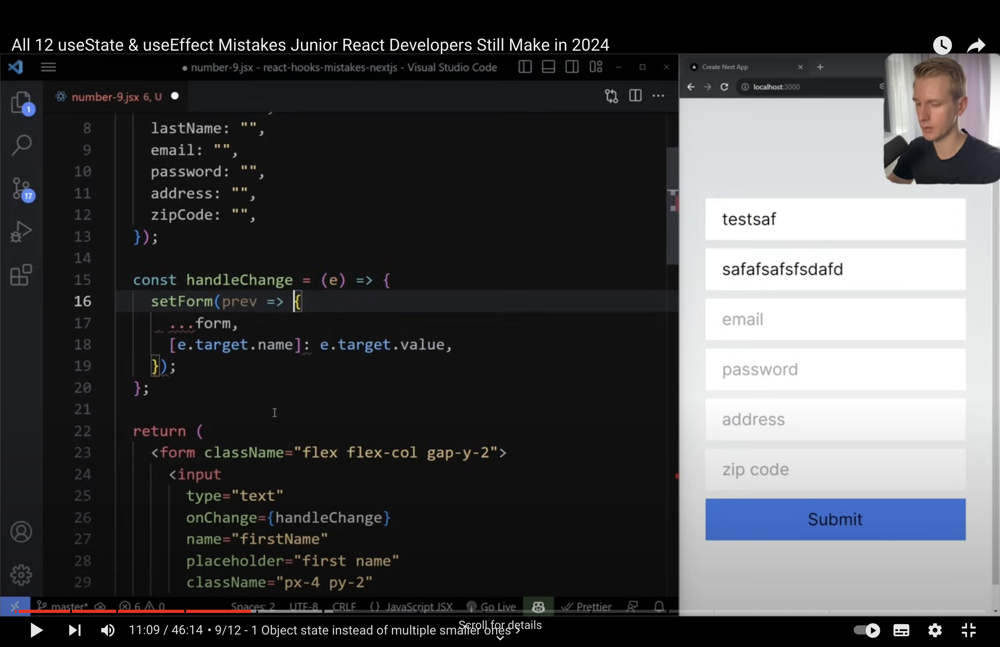

1. I always forget to return inside JSX, especially in .map() methods.
2. Forgetting {} and returning something in useEffect by mistake.
3. states are not hoisted.

# yt
1. conditional rendering, put usestate and useeffect before early returns
2. for forms: 