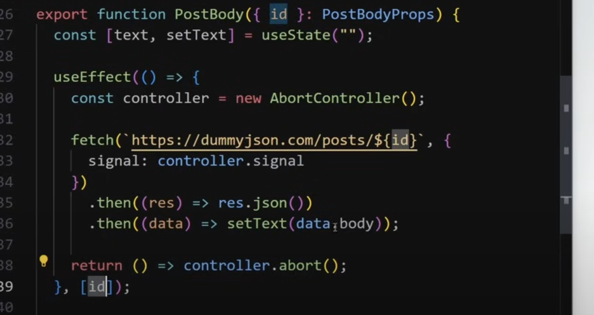
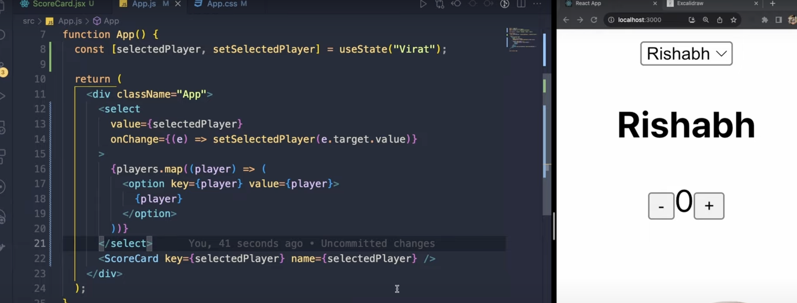
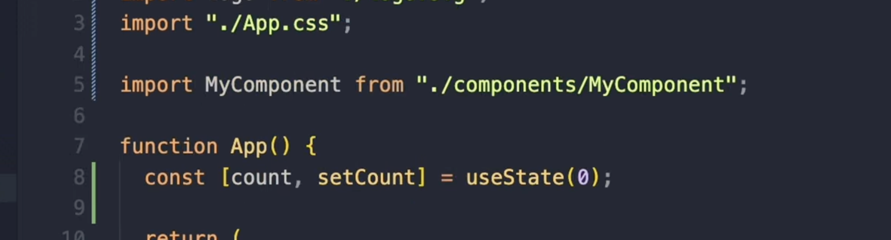
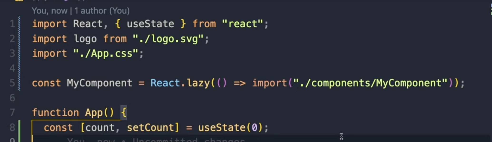
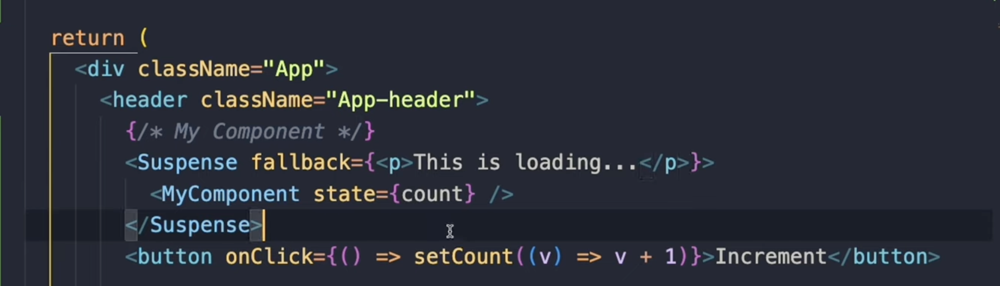

# some points
## 1. when multiple times useEffect is called while the previous calls are still in queue, you can cancel the previous useEffect's action and just run the one which was the latest using AbortController.


## 2. basic drop downs in react:


## 3. to optimize react apps:
### 1. Use lazy loading and Suspense
- if part of your code is computationallly heavy, like importing a large file, then you can lazy load it so that it doesn't slow down the entire app, and while it loads you can provide a loading state using `Suspese`:
before:

after:

and
```jsx
import React, { Suspens } from 'react';
// and ⬇️
```

- the arguement to `fallback` attribute is a react component.

- what all of this does is instead of slowing down the entire app we just lazy load the heavy component.
### 2. `useMemo()`
### 3. use `useEffect`'s cleanup function to remove event listeners as well as use `useCallback`